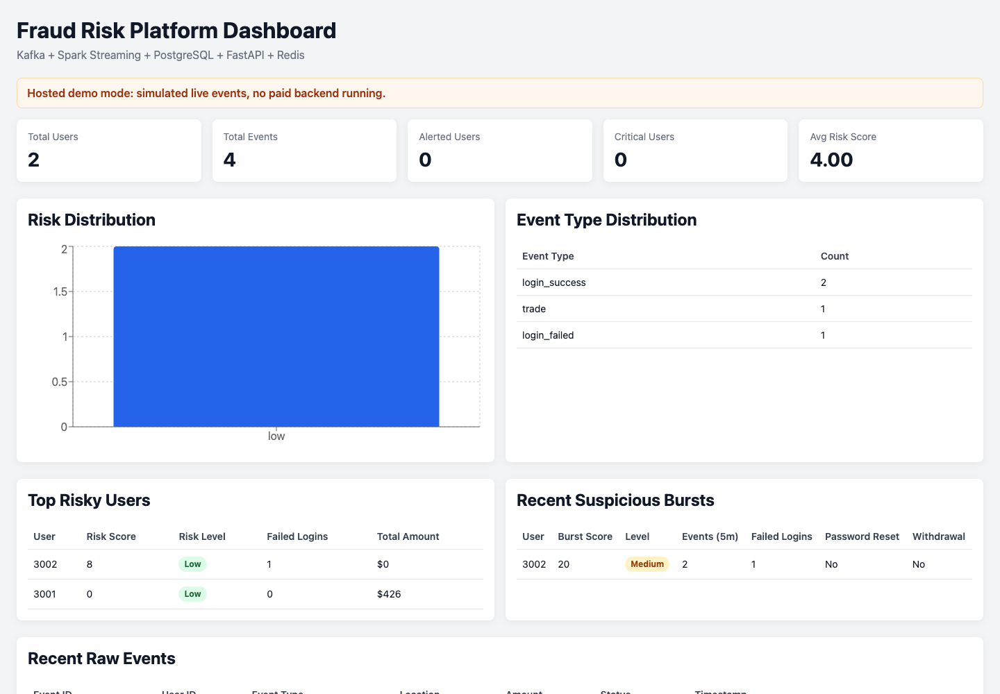
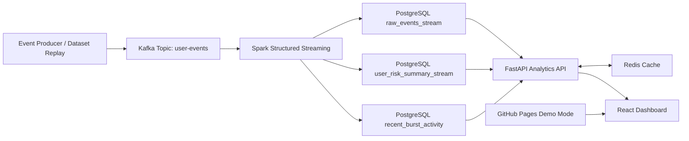

# Fraud Risk Streaming Platform

A production-style fraud monitoring system for account security and financial activity events. It is designed to show the real system around fraud detection: event ingestion, stream processing, replay-safe storage, operational APIs, caching, and an analyst dashboard.

This is intentionally more than a Kaggle notebook. Kaggle work is useful for offline analysis, but real fraud detection also needs a reliable data pipeline, explainable alerts, observability, and a way for people to review risk in near real time.

## Live Demo

- Live dashboard: [https://jasonavatarang.github.io/fraud-detection/](https://jasonavatarang.github.io/fraud-detection/)
- Pull request with production-demo upgrades: [PR #7](https://github.com/jasonavatarang/fraud-detection/pull/7)

The hosted demo is a free static GitHub Pages build. It simulates live events in the browser so recruiters can open it instantly without paid infrastructure. The full Kafka, Spark, PostgreSQL, Redis, and FastAPI stack is still runnable locally.



## What This Demonstrates

- Kafka-based event ingestion with replayable user activity events.
- Spark Structured Streaming micro-batches for fraud-risk feature engineering.
- PostgreSQL tables for immutable raw events and current user risk summaries.
- Idempotent writes keyed by `event_id`, so replayed events do not duplicate history.
- Redis-backed FastAPI analytics endpoints with graceful cache fallback.
- React + TypeScript dashboard for risk distribution, top users, suspicious bursts, and raw events.
- Dataset analysis tooling that can profile Kaggle-style fraud CSVs and export replayable demo events.
- GitHub Actions CI for API tests and dashboard builds.
- Free public demo hosting through GitHub Pages.

## Why This Project Matters

Fraud detection has real-world impact because high-risk account behavior needs to be visible quickly and explainably. A production fraud team needs more than a model score. They need:

- Raw event history for audit and investigation.
- Explainable risk features that analysts can understand.
- Fast operational views for suspicious users and bursts.
- Replay-safe processing so the system can recover from failures.
- A path from simple rules to labeled ML models once feedback exists.

The current scoring logic is rule-based on purpose. Rules are a strong baseline when labels are limited, and they make it easy to explain why a user was flagged. A later version could add supervised models, threshold tuning, analyst feedback, and model monitoring.

## System Design

### High-Level Architecture



Text version:

```text
Producer or dataset replay
  -> Kafka
  -> Spark Structured Streaming
  -> PostgreSQL raw events and risk summaries
  -> FastAPI analytics API
  -> Redis cache
  -> React dashboard
```

### Core Data Tables

- `raw_events_stream`: immutable event history keyed by `event_id`.
- `user_risk_summary_stream`: current user-level risk features and scores.
- `recent_burst_activity`: short-window suspicious activity signals.

### Fraud Signals

The system uses explainable fraud-risk indicators:

- Repeated failed logins.
- Password reset followed by withdrawal.
- Large withdrawals.
- MFA-disabled activity.
- High event velocity.
- Suspicious event bursts within a recent time window.

### Design Decisions

- **Kafka** decouples producers from consumers and supports replay.
- **Spark Structured Streaming** provides micro-batch feature engineering and a path to recomputation.
- **PostgreSQL** stores raw audit history and analyst-ready summaries.
- **Redis** speeds up dashboard queries but is optional at runtime.
- **FastAPI** exposes bounded operational endpoints for dashboards and investigation.
- **GitHub Pages demo mode** gives a free public demo without hosting the streaming backend.

### Production Tradeoffs

This repo is portfolio-scale, so some choices favor clarity over massive scale. The next production steps would be migrations, schema registry, dead-letter queues, structured logs, metrics, tracing, authentication, role-based access control, load tests, alert routing, rule/model versioning, and retention policies.

## How To Run

### Option 1: Open The Free Demo

Open the hosted dashboard:

```text
https://jasonavatarang.github.io/fraud-detection/
```

Use this for quick resume screens, recruiter messages, and interviews where you want to show the UI immediately.

### Option 2: Run The Full Local Streaming Stack

Requirements:

- Docker and Docker Compose.
- Node.js 20+ for local dashboard development.

Start Kafka, Spark, PostgreSQL, Redis, API, producer, and dashboard services:

```bash
docker compose up --build
```

Open the API docs:

```text
http://localhost:8000/docs
```

Open the local dashboard:

```text
http://localhost:5173
```

Replay a deterministic demo scenario:

```bash
docker compose --profile demo up demo-replay
```

Stop and remove local containers and volumes:

```bash
docker compose down -v
```

Local defaults are defined in `docker-compose.yml`. Copy `.env.example` only when you want to run individual services outside Compose or override defaults.

### Option 3: Run Just The Dashboard Locally

```bash
cd fraud-dashboard
npm install
npm run dev
```

Open:

```text
http://localhost:5173
```

Build the free hosted demo version:

```bash
cd fraud-dashboard
npm run build:demo
```

## Dataset Analysis

The repo can profile Kaggle-style fraud CSVs and project rows into replayable events for the streaming demo.

Profile a dataset and write a markdown report:

```bash
python analysis/analyze_fraud_dataset.py \
  --csv data/external/paysim/PS_20174392719_1491204439457_log.csv \
  --report reports/paysim-analysis.md
```

Export replayable events:

```bash
python analysis/analyze_fraud_dataset.py \
  --csv data/external/paysim/PS_20174392719_1491204439457_log.csv \
  --export-events data/imported/paysim_events.csv \
  --export-limit 1000
```

Replay exported events into Kafka:

```bash
python producer/replay_events.py \
  --file data/imported/paysim_events.csv \
  --bootstrap-servers localhost:9092
```

Useful public datasets to discuss:

- [PaySim mobile money fraud dataset](https://www.kaggle.com/datasets/ealaxi/paysim1)
- [Credit Card Fraud Detection](https://www.kaggle.com/datasets/mlg-ulb/creditcardfraud)
- [IEEE-CIS Fraud Detection competition](https://www.kaggle.com/competitions/ieee-fraud-detection)

See [docs/DATASETS_AND_DEMO.md](docs/DATASETS_AND_DEMO.md) for dataset commands and honest interview framing.

## API Endpoints

Health and readiness:

- `GET /health`
- `GET /ready`

Operational views:

- `GET /stream/users`
- `GET /stream/alerts`
- `GET /stream/users/{user_id}`
- `GET /stats/overview`
- `GET /stats/top-users?limit=10`
- `GET /stats/risk-distribution`
- `GET /stats/event-types`
- `GET /stats/recent-bursts`
- `GET /raw-events?limit=20`
- `GET /users/{user_id}/raw-events?limit=20`

## Testing

Run API and analysis tests:

```bash
python -m pip install -r api/requirements-dev.txt
python -m pytest api/tests analysis/tests
```

Build the dashboard:

```bash
npm ci --prefix fraud-dashboard
npm run build --prefix fraud-dashboard
```

Build the hosted demo:

```bash
npm run build:demo --prefix fraud-dashboard
```

CI runs API tests and dashboard builds on pull requests and pushes.

## Resume And Interview Framing

### Resume Bullet

> Built a real-time fraud risk streaming platform using Kafka, Spark Structured Streaming, PostgreSQL, Redis, FastAPI, and React; implemented replay-safe event ingestion, explainable risk scoring, cached analytics APIs, dataset replay tooling, CI, and a free hosted dashboard demo.

### 30 Second Pitch

I built a real-time fraud risk platform that ingests account events through Kafka, processes them with Spark Structured Streaming, stores raw events and user risk summaries in PostgreSQL, serves analytics through FastAPI with Redis caching, and displays suspicious users in a React dashboard. I also added dataset analysis tooling and a free GitHub Pages demo so the project can be shown without paid infrastructure.

### STAR Method Story

**Situation:** Fraud detection projects often stop at offline notebooks, but real teams need systems that can ingest events, recover from replay, expose risk to analysts, and explain why users are suspicious.

**Task:** Build a reusable portfolio project that demonstrates production-minded fraud detection, not just model accuracy on a static dataset.

**Action:** I designed an event-driven pipeline with Kafka, Spark Structured Streaming, PostgreSQL, Redis, FastAPI, and React. I added idempotent raw-event storage, explainable risk features, bounded API endpoints, cached dashboard queries, Kaggle-style dataset profiling, replay tooling, CI, and a static hosted demo.

**Result:** The project became a recruiter-friendly full-stack fraud platform with a live public dashboard, green CI, repeatable local runs, dataset analysis workflow, and clear production tradeoffs to discuss in interviews.

### Questions You Can Answer

- **Is this a Kaggle project?** No. It can analyze Kaggle datasets, but the main value is the production-style streaming system around fraud detection.
- **Is the public demo running Kafka and Spark?** No. The public demo is a free static build with simulated live events. The full stack runs locally with Docker Compose.
- **Why rules instead of ML?** Rules are an explainable baseline when labels are limited. With labels, the next step is supervised modeling, precision/recall evaluation, threshold tuning, and monitoring.
- **How do you handle replays?** Raw events are keyed by `event_id`, and inserts use conflict handling so duplicate replayed events do not duplicate history.
- **What would you improve next?** Add migrations, schema validation, auth, metrics, dead-letter queues, alert routing, model/rule versioning, and production load tests.

More prep: [docs/INTERVIEW_PREP.md](docs/INTERVIEW_PREP.md), [docs/PRODUCTION_NOTES.md](docs/PRODUCTION_NOTES.md), and [docs/DATASETS_AND_DEMO.md](docs/DATASETS_AND_DEMO.md).

## Project Structure

```text
api/                  FastAPI service and API tests
analysis/             Fraud CSV profiler and dataset-to-events exporter
data/                 Small deterministic demo events
docs/                 Interview, production, dataset, and screenshot assets
fraud-dashboard/      React + TypeScript dashboard
processing/           Spark Structured Streaming job
producer/             Synthetic producer and CSV replay producer
docker-compose.yml    Local full-stack orchestration
```
