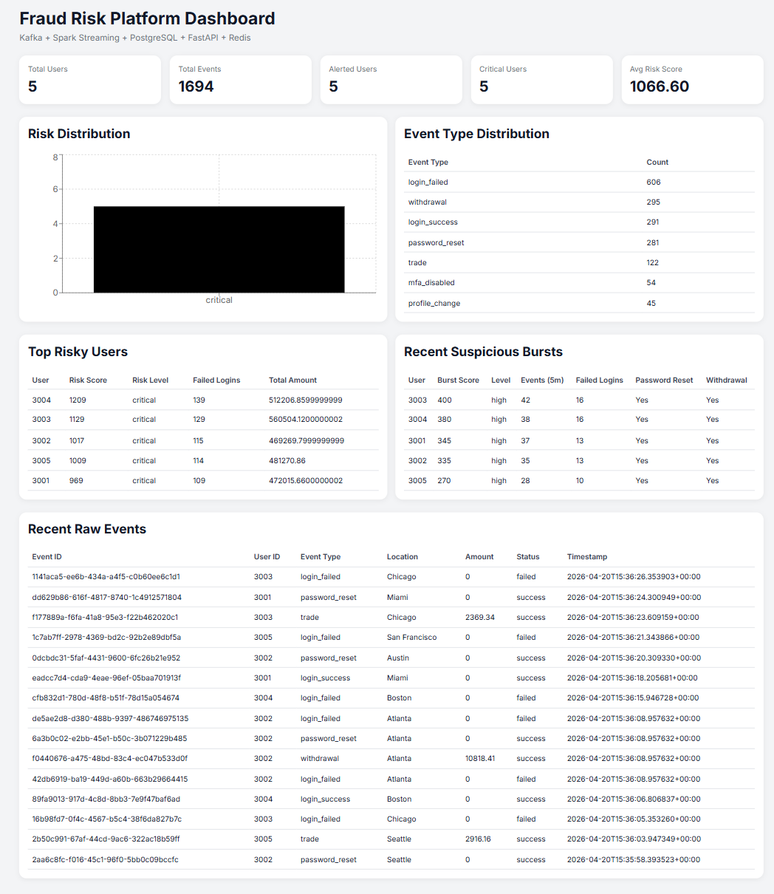

# Fraud Risk Streaming Platform

A real-time fraud risk monitoring system for account security and financial activity events. The project is intentionally framed as a production-style streaming platform, not a Kaggle notebook: it emphasizes event ingestion, replay-safe storage, feature engineering, operational APIs, caching, CI, and a dashboard an analyst could use.



## What It Demonstrates

- Event-driven architecture with Kafka producers and consumers.
- Spark Structured Streaming micro-batches for fraud-risk feature engineering.
- Idempotent raw event persistence keyed by `event_id`, so replayed events do not duplicate history.
- PostgreSQL as the source of truth for raw events and user risk summaries.
- Redis-backed FastAPI query caching with graceful cache-failure behavior.
- Bounded, parameterized API queries with health and readiness endpoints.
- React + TypeScript dashboard for live risk distribution, suspicious bursts, top users, and raw events.
- GitHub Actions CI for API tests and dashboard builds.

## Architecture

```text
Producer -> Kafka -> Spark Structured Streaming -> PostgreSQL -> FastAPI -> Redis -> React Dashboard
```

Storage layers:

- `raw_events_stream`: append-only event history keyed by `event_id`.
- `user_risk_summary_stream`: current user-level fraud risk features and scores.
- `recent_burst_activity`: short-window suspicious activity signals.

## Fraud Signals

The system scores account behavior using explainable rules:

- Repeated failed logins.
- Password reset followed by withdrawal.
- Large withdrawals.
- MFA disabled activity.
- High event velocity.
- Recent suspicious bursts over a configurable time window.

This rule-based baseline is useful when labels are unavailable. A production team could later replace or supplement it with a supervised model once confirmed fraud labels and analyst feedback exist.

## Quick Start

Requirements:

- Docker and Docker Compose.
- Node.js 20+ for local dashboard development.

## Free Hosted Demo

The repo includes a zero-cost hosted demo mode for GitHub Pages:

```text
https://jasonavatarang.github.io/fraud-detection/
```

The hosted page is a static React build with simulated live events, so it can run on free GitHub Pages without paying for Kafka, Spark, PostgreSQL, Redis, or API hosting. The full production-style stack remains available locally through Docker Compose.

After pushing to `main`, GitHub Actions runs `.github/workflows/pages.yml` and deploys the dashboard in `VITE_DEMO_MODE=true`. In the repository settings, set Pages to deploy from GitHub Actions if it is not already enabled.

Start the streaming backend:

```bash
docker compose up --build
```

Open the API docs:

```text
http://localhost:8000/docs
```

Run the dashboard:

```bash
cd fraud-dashboard
npm install
npm run dev
```

Open:

```text
http://localhost:5173
```

Replay a deterministic demo scenario:

```bash
docker compose --profile demo up demo-replay
```

Stop and remove local containers and volumes:

```bash
docker compose down -v
```

Local defaults are defined in `docker-compose.yml`. Copy `.env.example` only when you want to run individual services outside Compose or override defaults.

## Dataset Analysis

Profile a Kaggle-style fraud CSV and generate a markdown report:

```bash
python analysis/analyze_fraud_dataset.py \
  --csv data/external/paysim/PS_20174392719_1491204439457_log.csv \
  --report reports/paysim-analysis.md
```

Project dataset rows into replayable demo events:

```bash
python analysis/analyze_fraud_dataset.py \
  --csv data/external/paysim/PS_20174392719_1491204439457_log.csv \
  --export-events data/imported/paysim_events.csv \
  --export-limit 1000
```

Then replay them:

```bash
python producer/replay_events.py --file data/imported/paysim_events.csv --bootstrap-servers localhost:9092
```

See [docs/DATASETS_AND_DEMO.md](docs/DATASETS_AND_DEMO.md) for Kaggle download commands, demo workflow, and honest interview framing.

## API Endpoints

Health and readiness:

- `GET /health`
- `GET /ready`

Operational views:

- `GET /stream/users`
- `GET /stream/alerts`
- `GET /stream/users/{user_id}`
- `GET /stats/overview`
- `GET /stats/top-users?limit=10`
- `GET /stats/risk-distribution`
- `GET /stats/event-types`
- `GET /stats/recent-bursts`
- `GET /raw-events?limit=20`
- `GET /users/{user_id}/raw-events?limit=20`

## Testing

Run API tests:

```bash
python -m pip install -r api/requirements-dev.txt
python -m pytest api/tests
```

Build the dashboard:

```bash
npm ci --prefix fraud-dashboard
npm run build --prefix fraud-dashboard
```

CI runs both checks on pull requests and pushes to `main`.

## Resume Framing

Suggested resume bullet:

> Built a real-time fraud risk streaming platform using Kafka, Spark Structured Streaming, PostgreSQL, Redis, FastAPI, and React; implemented replay-safe event ingestion, explainable risk scoring, cached analytics APIs, and a live analyst dashboard with CI-backed tests/builds.

Strong interview framing:

- This is a systems project first, not a model-accuracy project.
- The core problem is making risky account behavior visible quickly and explainably.
- The design keeps raw events immutable so scoring logic can be changed and recomputed.
- The current scoring is a transparent baseline; the next version would add labels, precision/recall evaluation, threshold tuning, analyst feedback, and model monitoring.

See [docs/INTERVIEW_PREP.md](docs/INTERVIEW_PREP.md), [docs/PRODUCTION_NOTES.md](docs/PRODUCTION_NOTES.md), and [docs/DATASETS_AND_DEMO.md](docs/DATASETS_AND_DEMO.md) for deeper talking points, demo steps, and next-step ideas.
